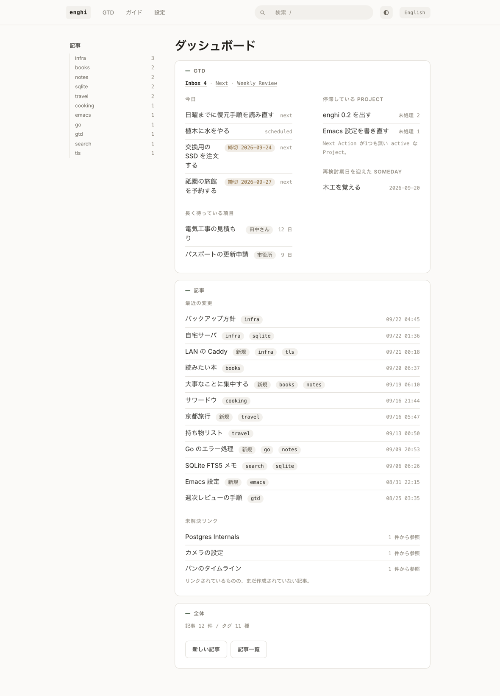
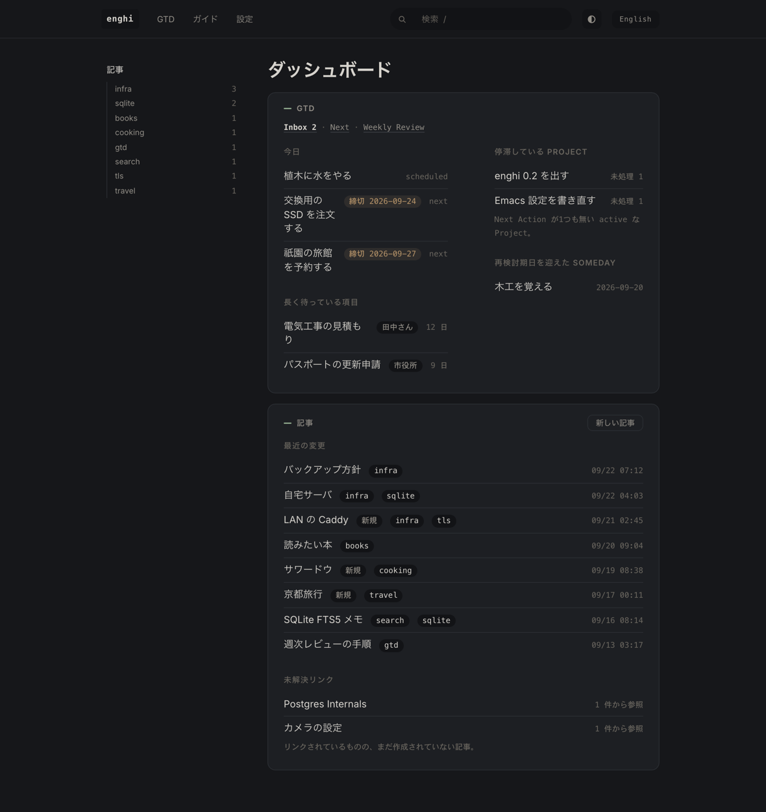

# enghi

*[English](README.md) · 日本語*

macOS と Linux で動く、ローカル専用の個人向け Wiki + GTD サーバ。常駐サービスとして
動作し、ブラウザから使う。データは一切マシン外に出ない。





## 特徴

- **高速な全文検索** ページもタスクも瞬時に引ける。SQLite FTS5 と trigram
  トークナイザを使うので、日本語も英語と同じようにヒットする
- **`[[wikilinks]]` はタイトルで解決。** ページ名を変更しても旧タイトルが
  エイリアスとして残り、リンクが切れない
- **Wiki 上の GTD:** inbox、next actions、プロジェクト、org-mode リピータ記法による
  定期タスク
- **Markdown エクスポート** 全データをいつでも書き出せる。データベース内に
  データが閉じ込められることはない
- **ローカル完結。** ループバックにバインドし、アカウントもクラウドも不要

## インストール

```sh
brew install wakamenod/tap/enghi
brew services start enghi     # macOS は launchd、Linux は systemd に登録する
```

http://127.0.0.1:7777/ を開く。GTD の導入や使い方は `/guide` を見る (日英対応)。

Homebrew を使わない場合は、[Releases](https://github.com/wakamenod/enghi/releases) の
tarball を展開し、`enghi install-agent -load` で常駐サービスを設定する。

## 設定

`~/.config/enghi/config.toml`。省略時はデフォルト値で動く。

```toml
port = 7777
db_path    = "~/.local/share/enghi/enghi.db"
export_dir = "~/.local/share/enghi/export"
revision_compact_minutes = 10   # この時間内の再編集は直前のリビジョンを上書きする

files_db_path  = "~/.local/share/enghi/enghi-files.db"   # 省略時は db_path に追従する
backup_dir     = "~/.local/share/enghi/backup"
backup_keep    = 7       # 保持する世代数
backup_enabled = true

skills_dir     = "~/.claude/skills"   # install-skill が Claude Code の Skill を書き出す先
```

## コマンド

```
enghi [serve]          常駐サーバを起動する
enghi export [--dir D] 全件を Markdown にエクスポート (--dir は CLI のみ。API は設定値を使う)
enghi doctor [--fix]   整合性チェック。--fix で混入した NFD テキストを修復する
enghi backup [--list]  DB バックアップ (--dir で出力先を指定)。常駐中は毎日実行する
enghi files [--prune]  画像やファイルの一覧。--prune で参照のないファイルを削除する
enghi install-agent    サービス設定を書き出す。-load で登録して起動する
enghi install-skill    Claude Code の Skill を ~/.claude/skills/enghi に書き出す
enghi version          バージョンを表示する
```

すべてのコマンドで `--config` を使って設定ファイルのパスを指定できる。

## サービスの管理と復元

`install-agent` は macOS では launchd の plist を `~/Library/LaunchAgents` に、
Linux では systemd の user unit を `~/.config/systemd/user` に書き出す。
**Linux ではログアウト後もサービスを動かし続けるために
`loginctl enable-linger` を実行する。**

バックアップには `VACUUM INTO` を使うため、WAL を取りこぼさず安全に DB を取得できる。
復元時はサーバを停止してファイルを置き換える:

```sh
brew services stop enghi        # または launchctl bootout / systemctl --user stop
cp ~/.local/share/enghi/backup/enghi-2026-09-21.db ~/.local/share/enghi/enghi.db
rm -f ~/.local/share/enghi/enghi.db-wal ~/.local/share/enghi/enghi.db-shm
brew services start enghi
```

## 自宅のスマホから安全にアクセスする

enghi は `127.0.0.1` にのみバインドし、ループバック以外の `Host` ヘッダには 403 を返す。
スマホからアクセスするには、**前段に Caddy を置いて TLS と認証を担当させる**。
enghi はループバックにバインドしたままにしておく。

```
iPhone ──https──▶ Caddy (LAN:443)  ──http──▶ enghi (127.0.0.1:7777)
                   ├ TLS 終端
                   └ パスワード検証
```

**絶対に `0.0.0.0` にバインドしないこと。** enghi には認証がないため、同じ Wi-Fi
にいる全員が読み書きできる状態になる。

### 1. Caddy をインストールし、パスワードをハッシュ化する

```sh
brew install caddy
caddy hash-password        # 対話形式で入力する。設定に平文を保存しない
```

### 2. Caddyfile を書く

`$(brew --prefix)/etc/Caddyfile` に書く。名前は `scutil --get LocalHostName` の出力 +
`.local` (例: `junnomacbook-pro.local`) に合わせる。

```
junnomacbook-pro.local {
    tls internal
    basic_auth {
        jun    $2a$14$...(caddy hash-password の出力)...
    }
    reverse_proxy 127.0.0.1:7777
}
```

```sh
brew services start caddy
```

### 3. enghi でホスト名を許可する

`~/.config/enghi/config.toml`:

```toml
allowed_hosts = ["junnomacbook-pro.local"]
```

届いた `Host` ヘッダが一致した場合にのみリクエストを受け付ける。ワイルドカードは
使えない (`*.local` は起動時にエラー)。省略時はループバックのみ許可する。

編集後に enghi を再起動する。

### 4. iPhone で証明書を信頼する

`tls internal` は Caddy が独自生成したルート CA を使うため、初回アクセス時に
Safari が警告を出す。ルート証明書 (パスは `caddy trust` か Caddy のデータ
ディレクトリで確認) を iPhone に転送し、**設定 → 一般 → 情報 → 証明書信頼設定**
で「全面的な信頼」を有効にする。

警告を無視してもページの閲覧はできるが、`wss://` が拒否され、ライブ更新
(Emacs からのフォーカス同期など) が動かなくなる。

### 注意

- **`basic_auth` を絶対に省略しないこと。** 省略すると同一 LAN 内の誰もが
  読み書きできてしまう
- `basic_auth` は以前 `basicauth` という名前だった。導入した Caddy のバージョンに
  合わせた構文を確認する
- Basic 認証はブラウザ標準のプロンプトを使うため、1Password などのパスワード
  マネージャーによる自動入力は効かない。長いランダムなパスワードを一度貼り付ければ、
  以後はブラウザが記憶する
- **自宅ネットワークの外からはアクセスできない** (宅内 LAN のみ)。リモートから
  アクセスする場合は Tailscale や Cloudflare Tunnel などの外部トンネルを使う。
  enghi 側はそのホスト名を `allowed_hosts` に追加するだけでよい
- `.local` 名は Mac の IP アドレス変更に追従する。IP の固定は要らない

## 定期タスクの記法

org-mode のリピータ記法に準拠 (`recurrence` カラムにそのまま格納):

| 記法 | 意味 | 基準 |
|---|---|---|
| `+1d` `+2w` `+1m` `+1y` | 固定間隔 | 前回の**予定日** + 間隔。1回分だけ進める |
| `++1w` | 固定間隔、未来まで追いつかせる | 今日より後になるまで繰り返し間隔を加算する |
| `.+3d` | 完了日基準 | **完了日** + 間隔 |
| `weekly:mon,thu` | 毎週の指定曜日 | 次に来る該当曜日 |
| `monthly:25` / `monthly:last` | 毎月 | 次の該当日 / 月末 |
| `yearly:04-01` | 毎年 | 次の該当日 |

タスクを完了 (またはスキップ) すると生成されるのは**次の1件だけ**なので、同一
シリーズで未完了のインスタンスは常に高々1件だ。生成されたインスタンスは必ず
`scheduled` 状態で始まる。存在しない日付 (小の月の31日、平年の2月29日など) は
その月の最終日に丸める。

## キーボードショートカット (Web UI)

`/` 検索 · `g d`/`g w`/`g i`/`g n`/`g p` 移動 · `c` クイックキャプチャ ·
`e` 編集 · `j`/`k` リスト移動 · `Enter` 開く · `Esc` 閉じる

## Claude Code から使う

`enghi install-skill` は [Claude Code](https://claude.com/claude-code) の Skill を
`~/.claude/skills/enghi` に書き出す (接続先は設定のポートになる)。以後 Claude Code に
「Inbox に入れといて」「wiki にまとめて」「前に書いた○○のメモを見て」「週次レビュー
手伝って」と頼めば enghi を操作する。Inbox への追加はすぐ行い、ページや GTD の変更は
書き込む前に内容を見せる。

設定画面の「Claude Code」パネルからもボタン1つで同じことができ、入っている Skill が
動いているサーバーと一致しているかも表示される。これは enghi が動いているマシンから
開いたときだけで、`allowed_hosts` 経由では使えない。

enghi を更新したら再実行して Skill も更新する。`skills/enghi/SKILL.md` の編集を
再インストールなしで試すなら、代わりにシンボリックリンクを張る:
`ln -s "$PWD/skills/enghi" ~/.claude/skills/enghi`。

## Emacs から使う

**[enghi.el](https://github.com/wakamenod/enghi.el)** を見る。

## 開発

**ビルドタグ `sqlite_fts5` と `CGO_ENABLED=1` が要る** (FTS5 と trigram
トークナイザ)。これらがないと意図的にビルドが失敗する (`cmd/enghi/require_*.go`)。
cgo のためクロスコンパイルはできず、リリース用バイナリは各ネイティブ runner で
ビルドする。

```sh
make build test vet     # ブラウザテストには npx playwright install chromium webkit が要る
```

`docs/guide/` に追記するときは、**すべての見出しに明示的な `{#id}` アンカーを付ける**
—— 自動生成の ID は日英で食い違い、アプリ内の `?` リンクが壊れる。
