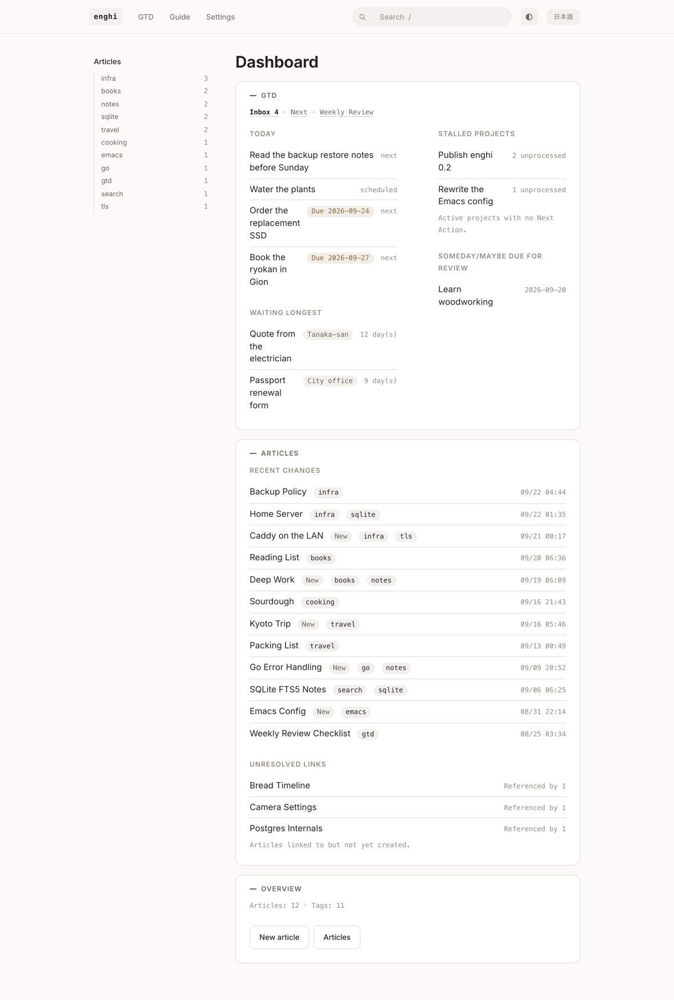
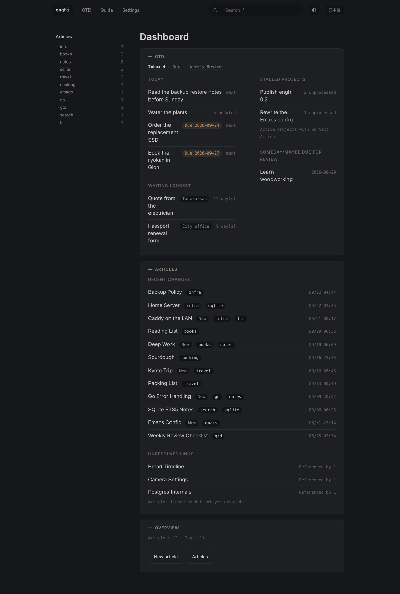

# enghi

*English · [日本語](README.ja.md)*

A local-only personal wiki + GTD server for macOS and Linux. It runs as a background
service and you use it from the browser. Nothing leaves the machine.





## Features

- **Instant full-text search** over pages and tasks, built on SQLite FTS5 with a
  trigram tokenizer, so Japanese matches as well as English
- **`[[wikilinks]]` resolved by title.** Renaming a page keeps the old title as an
  alias, so links to it stay alive
- **GTD on top of the wiki:** inbox, next actions, projects, and recurring tasks in
  org-mode repeater syntax
- **Markdown export** of everything, any time. Nothing is locked inside the database
- **Local only.** Binds to loopback, no account, no cloud

## Installation

```sh
brew install wakamenod/tap/enghi
brew services start enghi     # Registers with launchd on macOS, systemd on Linux
```

Open http://127.0.0.1:7777/. See `/guide` for GTD introduction and usage (English and
Japanese).

Without Homebrew, unpack the tarball from
[Releases](https://github.com/wakamenod/enghi/releases) and run `enghi install-agent
-load` to set up the background service.

## Configuration

`~/.config/enghi/config.toml`. Runs with defaults if omitted.

```toml
port = 7777
db_path    = "~/.local/share/enghi/enghi.db"
export_dir = "~/.local/share/enghi/export"
revision_compact_minutes = 10   # re-edits within this window overwrite the last revision
deadline_warning_days    = 7    # how many days ahead the dashboard shows a deadline

files_db_path  = "~/.local/share/enghi/enghi-files.db"   # Tracks db_path if omitted
backup_dir     = "~/.local/share/enghi/backup"
backup_keep    = 7       # Generations to keep
backup_enabled = true

skills_dir     = "~/.claude/skills"   # Where install-skill writes the Claude Code skill

calendar_shortcut      = "enghi-events"   # macOS: the Shortcuts shortcut that reads the calendar
calendar_sync_interval = "30m"            # how often it runs while the sync is on
```

## Commands

```
enghi [serve]          Start resident server
enghi export [--dir D] Export everything to Markdown (--dir CLI only; API uses config value)
enghi doctor [--fix]   Integrity check. --fix repairs stray NFD text
enghi backup [--list]  Database backup (--dir sets destination). Runs daily while resident
enghi files [--prune]  List images and files. --prune removes unreferenced files
enghi install-agent    Write service config. -load registers and starts it
enghi install-skill    Write the Claude Code skill to ~/.claude/skills/enghi
enghi version          Print version
```

All commands accept `--config` to specify the configuration file path.

## Service Management and Recovery

`install-agent` writes a launchd plist to `~/Library/LaunchAgents` on macOS, or a
systemd user unit to `~/.config/systemd/user` on Linux. **On Linux, run `loginctl
enable-linger` to keep the service running after logout.**

Backups use `VACUUM INTO`, capturing the database cleanly without missing WAL entries.
To restore, stop the server and replace the file:

```sh
brew services stop enghi        # Or launchctl bootout / systemctl --user stop
cp ~/.local/share/enghi/backup/enghi-2026-09-21.db ~/.local/share/enghi/enghi.db
rm -f ~/.local/share/enghi/enghi.db-wal ~/.local/share/enghi/enghi.db-shm
brew services start enghi
```

## Secure Mobile Access at Home

enghi binds only to `127.0.0.1` and returns 403 unless the `Host` header is loopback.
To access it from a phone, **place Caddy in front to handle TLS and authentication**.
Leave enghi bound to loopback.

```
iPhone ──https──▶ Caddy (LAN:443)  ──http──▶ enghi (127.0.0.1:7777)
                   ├ TLS termination
                   └ Password verification
```

**Never bind to `0.0.0.0`.** enghi has no authentication; doing so gives read/write
access to everyone on your Wi-Fi.

### 1. Install Caddy and hash your password

```sh
brew install caddy
caddy hash-password        # Enter interactively; do not store plaintext in config
```

### 2. Write the Caddyfile

`$(brew --prefix)/etc/Caddyfile`. Name matches `scutil --get LocalHostName` + `.local`
(e.g. `junnomacbook-pro.local`).

```
junnomacbook-pro.local {
    tls internal
    basic_auth {
        jun    $2a$14$...(caddy hash-password output)...
    }
    reverse_proxy 127.0.0.1:7777
}
```

```sh
brew services start caddy
```

### 3. Allow the hostname in enghi

`~/.config/enghi/config.toml`:

```toml
allowed_hosts = ["junnomacbook-pro.local"]
```

Requests are accepted only when the incoming `Host` header matches. Wildcards are not
allowed (`*.local` produces an error on startup). Defaults to loopback only if omitted.

Restart enghi after editing.

### 4. Trust the certificate on iPhone

Because `tls internal` uses Caddy's self-generated root CA, Safari will warn on first
access. Transfer the root certificate (find its path via `caddy trust` or in Caddy's
data directory) to your iPhone, then enable "Full Trust" under **Settings → General →
About → Certificate Trust Settings**.

Ignoring the warning lets you browse pages, but `wss://` will be rejected, breaking live
updates (such as focus sync from Emacs).

### Notes

- **Never omit `basic_auth`.** Without it, anyone on the same LAN has read/write access
- `basic_auth` was previously named `basicauth`. Verify the syntax for your installed
  Caddy version
- Basic auth uses the browser's native prompt, so password manager autofill (like
  1Password) does not work. Paste a long random password once; the browser will remember
  it
- **Not accessible outside your home network** (home LAN only). For remote access, use
  an external tunnel like Tailscale or Cloudflare Tunnel. On the enghi side, simply add
  that hostname to `allowed_hosts`
- The `.local` name tracks IP changes on your Mac. No static IP needed

## Recurring Task Syntax

Follows org-mode repeater syntax (stored directly in the `recurrence` column):

| Syntax | Meaning | Basis |
|---|---|---|
| `+1d` `+2w` `+1m` `+1y` | Fixed interval | Previous **scheduled date** + interval. Advances by one step |
| `++1w` | Fixed interval, catch up to future | Adds interval repeatedly until after today |
| `.+3d` | Completion-based | **Completion date** + interval |
| `weekly:mon,thu` | Specific days each week | Next matching weekday |
| `monthly:25` / `monthly:last` | Monthly | Next matching date / end of month |
| `yearly:04-01` | Yearly | Next matching date |

Completing (or skipping) a task generates **only the next single instance**, so there is
always at most one open instance per series. Generated instances always start in the
`scheduled` state. Dates that do not exist (a 31st in a short month, Feb 29 in a
non-leap year) clamp to the last day of that month.

## Calendar (macOS)

enghi can show your calendar events without changing them: today's schedule on the
dashboard, and each day's events in its work record. Google calendars you add to the
macOS Calendar app under Internet Accounts show up too. A Shortcuts shortcut reads the
events, because Shortcuts holds the calendar permission, and enghi runs it every 30
minutes. To set it up, click **Add shortcut** in **Settings → Calendar**, run the
shortcut once in Shortcuts to allow calendar access, and turn on the sync. **Make a
task** on an event creates a task named with the event's time and scheduled for its
day. The guide (`/guide/enghi#calendar`) explains how to build the shortcut by hand
and what to do when something goes wrong. On any system, other tools can send events
with `PUT /api/calendar/events`.

## Keyboard Shortcuts (Web UI)

`/` Search · `g d`/`g w`/`g i`/`g n`/`g p` Navigation · `c` Quick capture ·
`e` Edit · `j`/`k` List navigation · `Enter` Open · `o` Open the task's URL ·
`Esc` Dismiss

## Using from Claude Code

`enghi install-skill` writes a [Claude Code](https://claude.com/claude-code) skill to
`~/.claude/skills/enghi`, pointed at the configured port. Claude Code then works with
enghi when you ask in plain words: "put this in my inbox", "write this up in the wiki",
"find my notes on X", "what should I do today?", "help me with the weekly review". It captures right away, but
shows pages and GTD changes to you before writing them.

The Claude Code panel on the Settings screen does the same with one button, and shows
whether the installed skill matches the running server. It is only offered on the
machine enghi runs on, not through `allowed_hosts`.

Run it again after upgrading enghi to update the skill. To try edits to
`skills/enghi/SKILL.md` without reinstalling, symlink the directory instead:
`ln -s "$PWD/skills/enghi" ~/.claude/skills/enghi`.

## Using from Emacs

See **[enghi.el](https://github.com/wakamenod/enghi.el)**.

## Development

**The `sqlite_fts5` build tag and `CGO_ENABLED=1` are required** (FTS5 and the trigram
tokenizer); the build fails on purpose without them (`cmd/enghi/require_*.go`). cgo
rules out cross-compiling, so release binaries are built on native runners.

```sh
make build test vet     # browser tests need: npx playwright install chromium webkit
```

When adding to `docs/guide/`, **give every heading an explicit `{#id}` anchor** —
auto-generated IDs diverge between English and Japanese and break the in-app `?` links.
